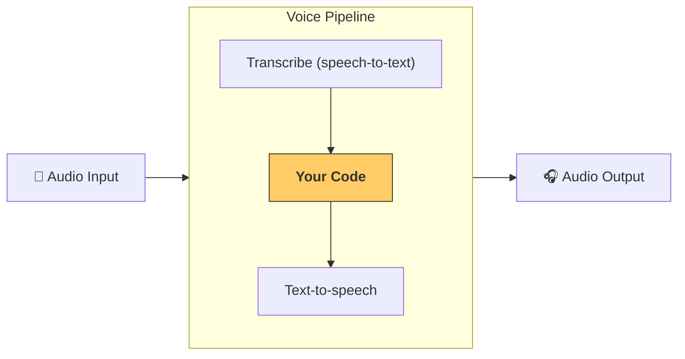

---
search:
  exclude: true
---
# パイプラインとワークフロー

[`VoicePipeline`][agents.voice.pipeline.VoicePipeline] は、エージェントワークフローを音声アプリに簡単に変換できるクラスです。実行するワークフローを渡すと、このパイプラインが入力音声の文字起こし、音声終了の検知、適切なタイミングでのワークフロー呼び出し、そしてワークフロー出力を再び音声へ変換する処理を自動で行います。



## パイプラインの設定

パイプラインを作成する際、次の項目を設定できます。

1. [`workflow`][agents.voice.workflow.VoiceWorkflowBase]  
   新しい音声が文字起こしされるたびに実行されるコードです。  
2. [`speech-to-text`][agents.voice.model.STTModel] と [`text-to-speech`][agents.voice.model.TTSModel] の各モデル  
3. [`config`][agents.voice.pipeline_config.VoicePipelineConfig]  
   これにより以下のような設定が可能です。  
   - モデルプロバイダー：モデル名をモデルにマッピングします  
   - トレーシング：トレーシングの無効化、音声ファイルのアップロード有無、ワークフロー名、トレース ID など  
   - TTS と STT モデルの設定：プロンプト、言語、使用するデータ型 など  

## パイプラインの実行

パイプラインは [`run()`][agents.voice.pipeline.VoicePipeline.run] メソッドで実行します。音声入力は次の 2 つの形式を渡せます。

1. [`AudioInput`][agents.voice.input.AudioInput]  
   完全な音声ファイルがあり、その文字起こし結果だけからレスポンスを生成したい場合に使用します。話者が話し終わるタイミングを検知する必要がない、録音済み音声やプッシュ・トゥー・トークアプリなどで便利です。  
2. [`StreamedAudioInput`][agents.voice.input.StreamedAudioInput]  
   話者が話し終わったかどうかを検知する必要がある場合に使用します。音声チャンクを検出次第プッシュでき、パイプラインが「アクティビティ検知」により適切なタイミングでエージェントワークフローを実行します。  

## 結果

音声パイプライン実行の結果は [`StreamedAudioResult`][agents.voice.result.StreamedAudioResult] です。このオブジェクトはイベントをストリーミング形式で受け取れます。主な [`VoiceStreamEvent`][agents.voice.events.VoiceStreamEvent] は次のとおりです。

1. [`VoiceStreamEventAudio`][agents.voice.events.VoiceStreamEventAudio]  
   音声チャンクを含みます。  
2. [`VoiceStreamEventLifecycle`][agents.voice.events.VoiceStreamEventLifecycle]  
   ターンの開始や終了など、ライフサイクルイベントを通知します。  
3. [`VoiceStreamEventError`][agents.voice.events.VoiceStreamEventError]  
   エラーイベントです。  

```python

result = await pipeline.run(input)

async for event in result.stream():
    if event.type == "voice_stream_event_audio":
        # play audio
    elif event.type == "voice_stream_event_lifecycle":
        # lifecycle
    elif event.type == "voice_stream_event_error"
        # error
    ...
```

## ベストプラクティス

### 割り込み

現時点では、 Agents SDK は [`StreamedAudioInput`][agents.voice.input.StreamedAudioInput] に対する組み込みの割り込み機能をサポートしていません。検出された各ターンごとに、別々にワークフローを実行します。アプリケーション内で割り込みを処理したい場合は、[`VoiceStreamEventLifecycle`][agents.voice.events.VoiceStreamEventLifecycle] イベントを監視してください。`turn_started` は新しいターンが文字起こしされ処理が開始されたことを示し、`turn_ended` は該当ターンの音声がすべて送出された後にトリガーされます。モデルがターンを開始した際にマイクをミュートし、関連音声をすべて送信した後でアンミュートする、といった制御にこれらのイベントを活用できます。