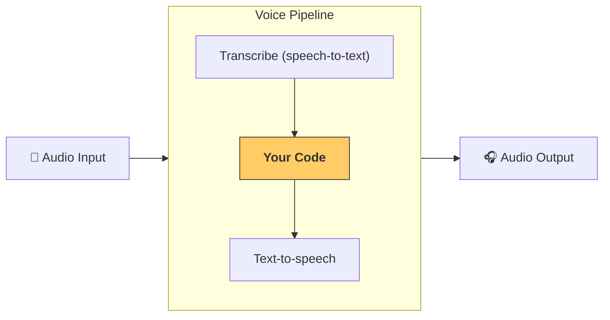

---
search:
  exclude: true
---
# パイプラインとワークフロー

[`VoicePipeline`][agents.voice.pipeline.VoicePipeline] は、エージェント型ワークフローを音声アプリへ簡単に変換できるクラスです。実行したいワークフローを渡すだけで、入力音声の書き起こし、音声終了の検出、適切なタイミングでのワークフロー呼び出し、そしてワークフロー出力を再び音声へ変換する処理をパイプラインが自動で行います。



## パイプラインの設定

パイプラインを作成する際に設定できる項目は次のとおりです。

1. [`workflow`][agents.voice.workflow.VoiceWorkflowBase]  
   新しい音声が書き起こされるたびに実行されるコードです。  
2. [`speech-to-text`][agents.voice.model.STTModel] と [`text-to-speech`][agents.voice.model.TTSModel]  
   使用する STT／TTS モデルです。  
3. [`config`][agents.voice.pipeline_config.VoicePipelineConfig]  
   以下のような設定を行えます。  
    - モデルプロバイダー : モデル名をモデルにマッピングします  
    - トレーシング : トレーシングの有効／無効、音声ファイルのアップロード可否、ワークフロー名、トレース ID など  
    - TTS と STT モデルの設定 : プロンプト、言語、使用するデータ型 など  

## パイプラインの実行

[`run()`][agents.voice.pipeline.VoicePipeline.run] メソッドでパイプラインを実行できます。音声入力は 2 つの形式で渡せます。

1. [`AudioInput`][agents.voice.input.AudioInput]  
   完全な音声トランスクリプトがある場合に使用し、その内容に対する結果だけを生成します。発話終了検出が不要な、事前録音音声やプッシュトゥトーク アプリなどで便利です。  
2. [`StreamedAudioInput`][agents.voice.input.StreamedAudioInput]  
   発話終了を検出する必要がある場合に使用します。検出された音声チャンクを順次プッシュでき、パイプラインが「アクティビティ検出」と呼ばれるプロセスを通じて適切なタイミングでエージェント ワークフローを自動実行します。  

## 実行結果

音声パイプライン実行の結果は [`StreamedAudioResult`][agents.voice.result.StreamedAudioResult] です。これは、発生するイベントをストリーミングできるオブジェクトで、いくつかの [`VoiceStreamEvent`][agents.voice.events.VoiceStreamEvent] を含みます。

1. [`VoiceStreamEventAudio`][agents.voice.events.VoiceStreamEventAudio] : 音声チャンクを含みます。  
2. [`VoiceStreamEventLifecycle`][agents.voice.events.VoiceStreamEventLifecycle] : ターンの開始／終了などライフサイクルイベントを通知します。  
3. [`VoiceStreamEventError`][agents.voice.events.VoiceStreamEventError] : エラーイベントです。  

```python

result = await pipeline.run(input)

async for event in result.stream():
    if event.type == "voice_stream_event_audio":
        # play audio
    elif event.type == "voice_stream_event_lifecycle":
        # lifecycle
    elif event.type == "voice_stream_event_error"
        # error
    ...
```

## ベストプラクティス

### 割り込み

Agents SDK には [`StreamedAudioInput`][agents.voice.input.StreamedAudioInput] 用のビルトイン割り込みサポートは現在ありません。そのため、検出された各ターンごとにワークフローが個別に実行されます。アプリケーション内で割り込みを扱いたい場合は、[`VoiceStreamEventLifecycle`][agents.voice.events.VoiceStreamEventLifecycle] を監視してください。  
`turn_started` は新しいターンが書き起こされ処理が始まったことを示し、`turn_ended` は該当ターンの音声がすべて送信された後に発火します。これらのイベントを用いて、モデルがターンを開始した際に話者のマイクをミュートし、ターンに関連する音声をすべて送信し終えた後でアンミュートする、といった実装が可能です。