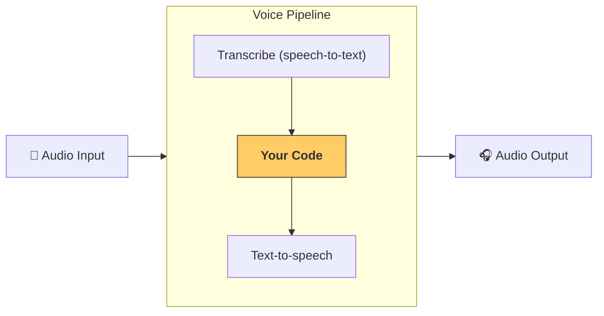

---
search:
  exclude: true
---
# パイプラインとワークフロー

[`VoicePipeline`][agents.voice.pipeline.VoicePipeline] クラスを使用すると、 エージェントのワークフローを簡単に音声アプリへ変換できます。 実行したいワークフローを渡すと、 パイプラインが入力音声の文字起こし、 音声終了の検出、 適切なタイミングでのワークフロー呼び出し、 そしてワークフローの出力を再び音声へ変換する処理を自動で行います。



## パイプラインの設定

パイプラインを作成するときに、 次の項目を設定できます。

1. [`workflow`][agents.voice.workflow.VoiceWorkflowBase] — 新しい音声が文字起こしされるたびに実行されるコード  
2. 使用する [`speech-to-text`][agents.voice.model.STTModel] モデルと [`text-to-speech`][agents.voice.model.TTSModel] モデル  
3. [`config`][agents.voice.pipeline_config.VoicePipelineConfig] — 以下のような項目を設定できます  
    - モデル名をモデルにマッピングするモデルプロバイダー  
    - トレーシングの設定（トレーシングの無効化、 音声ファイルのアップロード有無、 ワークフロー名、 trace ID など）  
    - TTS および STT モデルのプロンプト、 使用言語、 データ型などの設定  

## パイプラインの実行

パイプラインは [`run()`][agents.voice.pipeline.VoicePipeline.run] メソッドで実行できます。 このとき、 2 つの形式で音声入力を渡せます。

1. [`AudioInput`][agents.voice.input.AudioInput] — 完全な音声の文字起こしがあり、 その結果だけを取得したい場合に使用します。 たとえば、 あらかじめ録音された音声や、 プッシュトゥトーク方式で発話終了が明確なアプリなど、 話者の発話終了を検出する必要がないケースで便利です。  
2. [`StreamedAudioInput`][agents.voice.input.StreamedAudioInput] — 話者がいつ発話を終えたかを検出する必要がある場合に使用します。 検出された音声チャンクを逐次送信でき、 ボイスパイプラインが「アクティビティ検出」と呼ばれるプロセスを通じて、 適切なタイミングで自動的にエージェントワークフローを実行します。  

## 結果

ボイスパイプラインの実行結果は [`StreamedAudioResult`][agents.voice.result.StreamedAudioResult] です。 このオブジェクトにより、 生成されるイベントをリアルタイムでストリーミングできます。 [`VoiceStreamEvent`][agents.voice.events.VoiceStreamEvent] にはいくつか種類があり、 代表的なものは次のとおりです。  

1. [`VoiceStreamEventAudio`][agents.voice.events.VoiceStreamEventAudio] — 音声チャンクを含みます。  
2. [`VoiceStreamEventLifecycle`][agents.voice.events.VoiceStreamEventLifecycle] — ターンの開始・終了などライフサイクルイベントを通知します。  
3. [`VoiceStreamEventError`][agents.voice.events.VoiceStreamEventError] — エラーイベントです。  

```python

result = await pipeline.run(input)

async for event in result.stream():
    if event.type == "voice_stream_event_audio":
        # play audio
    elif event.type == "voice_stream_event_lifecycle":
        # lifecycle
    elif event.type == "voice_stream_event_error"
        # error
    ...
```

## ベストプラクティス

### 割り込み

Agents SDK には現在、 [`StreamedAudioInput`][agents.voice.input.StreamedAudioInput] に対する組み込みの割り込みサポートはありません。 そのため、 検出された各ターンごとにワークフローが個別に実行されます。 アプリケーション内で割り込みを扱いたい場合は、 [`VoiceStreamEventLifecycle`][agents.voice.events.VoiceStreamEventLifecycle] イベントを監視してください。 `turn_started` は新しいターンが文字起こしされ、 処理が始まったことを示します。 `turn_ended` は該当ターンのすべての音声が配信された後にトリガーされます。 これらのイベントを利用して、 モデルがターンを開始したときに話者のマイクをミュートし、 関連する音声をすべて送信し終えたらアンミュートするといった制御が可能です。